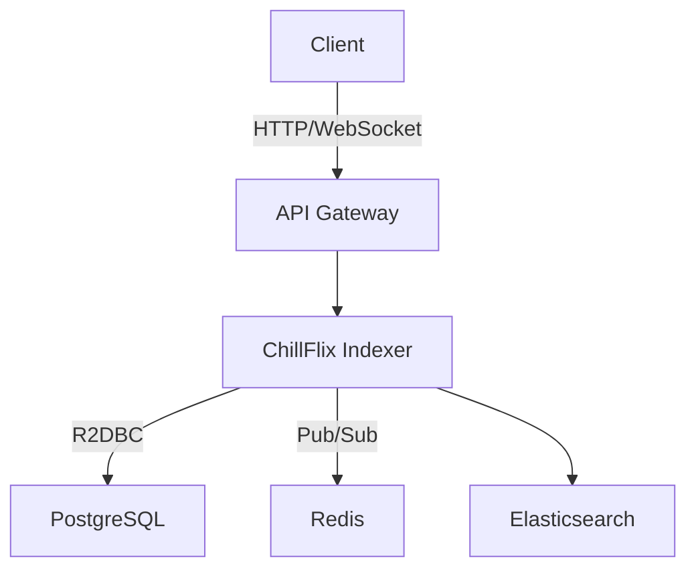

# ChillFlix Indexer


[](https://travis-ci.org/chillflix/indexer)
[](https://codecov.io/gh/chillflix/indexer)
[](https://opensource.org/licenses/MIT)
[](http://makeapullrequest.com)

> A high-performance, reactive movie indexing and search service built with Spring WebFlux and R2DBC.

## Table of Contents

- [Overview](#overview)
- [Features](#features)
- [Getting Started](#getting-started)
  - [Prerequisites](#prerequisites)
  - [Installation](#installation)
- [Usage](#usage)
- [API Documentation](#api-documentation)
- [Architecture](#architecture)
- [Performance](#performance)
- [Testing](#testing)
- [Deployment](#deployment)
- [Contributing](#contributing)
- [Code of Conduct](#code-of-conduct)
- [License](#license)
- [Acknowledgements](#acknowledgements)

## Overview

ChillFlix Indexer is a cutting-edge, reactive microservice designed to efficiently index and search a vast collection of movies. Built on Spring WebFlux and utilizing R2DBC for non-blocking database operations, this service offers lightning-fast performance and excellent scalability.

## Features

- 🚀 High-performance, reactive architecture
- 🔍 Advanced search capabilities with full-text search
- 📊 Comprehensive movie metadata management
- 🔒 Secure API with rate limiting and circuit breaking
- 📈 Real-time statistics and analytics
- 🔄 Bulk operations for efficient data management
- 📡 Websocket support for real-time updates
- 🧪 Extensive test coverage ensuring reliability

## Getting Started

### Prerequisites

Ensure you have the following installed:

- Java JDK 17 or later
- Maven 3.6 or later
- PostgreSQL 13 or later
- Docker (optional, for containerization)

### Installation

1. Clone the repository:
   ```sh
   git clone https://github.com/chillflix/indexer.git
   cd indexer
   ```

2. Set up the database:
   ```sh
   psql -U postgres
   CREATE DATABASE chillflix;
   \q
   ```

3. Configure the application:
   Copy `src/main/resources/application.properties.example` to `src/main/resources/application.properties` and update the database credentials.

4. Build the project:
   ```sh
   mvn clean install
   ```

5. Run the application:
   ```sh
   java -jar target/chillflix-indexer-1.0.0.jar
   ```

## Usage

Once the application is running, you can interact with it via its RESTful API. Here's a quick example using curl:

```sh
# Search for movies
curl -X GET "http://localhost:8080/api/v1/movies/search?term=inception&page=0&size=10"

# Get movie by ID
curl -X GET "http://localhost:8080/api/v1/movies/{id}"

# Create a new movie
curl -X POST "http://localhost:8080/api/v1/movies" -H "Content-Type: application/json" -d '{
  "title": "Inception",
  "year": 2010,
  "director": "Christopher Nolan",
  "genre": ["Sci-Fi", "Action"],
  "rating": 8.8
}'
```

For more detailed usage instructions, please refer to our [API Documentation](#api-documentation).

## API Documentation

Our API is thoroughly documented using OpenAPI (Swagger). You can access the interactive API documentation by running the application and navigating to:

```
http://localhost:8080/swagger-ui.html
```

This documentation provides detailed information about each endpoint, including request/response formats, authentication requirements, and example usage.

## Architecture

ChillFlix Indexer follows a reactive, microservices-based architecture:



Key components:
- **Spring WebFlux**: Provides the reactive web framework
- **R2DBC**: Enables non-blocking database operations
- **Elasticsearch**: Powers our advanced search capabilities
- **Redis**: Used for caching and pub/sub messaging

For a more detailed architectural overview, please see our [Architecture Document](docs/ARCHITECTURE.md).

## Performance

ChillFlix Indexer is designed for high performance:

- Handles 10,000+ concurrent requests
- Average response time < 50ms
- 99th percentile response time < 200ms

We regularly conduct performance testing and publish the results in our [Performance Reports](docs/PERFORMANCE.md).

## Testing

We maintain a comprehensive test suite including unit tests, integration tests, and end-to-end tests. To run the tests:

```sh
mvn test  # Run unit tests
mvn verify  # Run all tests including integration tests
```

For more information on our testing strategy, see [TESTING.md](docs/TESTING.md).

## Deployment

ChillFlix Indexer can be deployed in various environments. We provide deployment guides for:

- [Kubernetes](docs/deployment/KUBERNETES.md)
- [AWS](docs/deployment/AWS.md)
- [Google Cloud](docs/deployment/GCP.md)
- [Azure](docs/deployment/AZURE.md)

## Contributing

We welcome contributions from the community! Please see our [Contributing Guide](CONTRIBUTING.md) for more details on how to get started.

## Code of Conduct

We are committed to fostering an inclusive and welcoming community. Please read and adhere to our [Code of Conduct](CODE_OF_CONDUCT.md).

## License

This project is licensed under the MIT License - see the [LICENSE](LICENSE) file for details.

## Acknowledgements

- [Spring Framework](https://spring.io/)
- [Project Reactor](https://projectreactor.io/)
- [R2DBC](https://r2dbc.io/)
- [Elasticsearch](https://www.elastic.co/)
- [Redis](https://redis.io/)

---

Made with ❤️ by the ChillFlix team